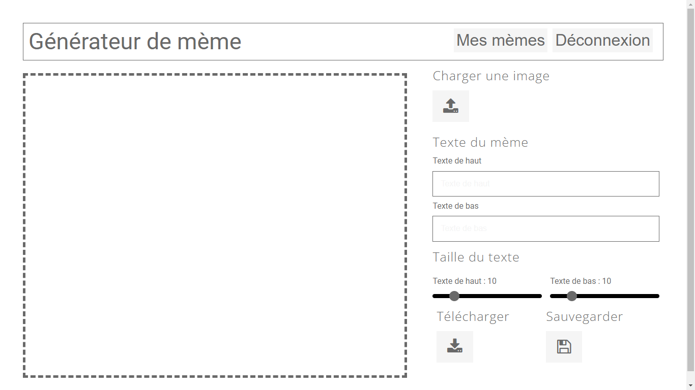

# MINI PROJET : GENERATEUR DE MEME

## Aperçu


## Base de données
Voici le code SQL du schéma de la base de données :
```SQL
-- Table users
CREATE TABLE users (username varchar(255) PRIMARY KEY, name varchar(255), password varchar(255));
-- Table memes
CREATE TABLE memes (id int AUTO_INCREMENT PRIMARY KEY, top_text text, bottom_text text, top_size int, bottom_size int, img text, source_img text, username varchar(255), FOREIGN KEY (username) REFERENCES users(username));
```
Vous pouvez aussi retrouver ce code dans le fichier : ```assets/database.sql```

## Connexion à la base de données : ```classes/Database.php```
Il faut modifier dans ce fichier les détails de connexion à la base de données relatives au serveur.
Infos par défaut :
```PHP
private $host = "localhost";
private $dbname = "meme";
private $username = "root";
private $password = "";
```

## Exécution de l'application
Au lancement de l'application, on ce retrouve au niveau de la page de connexion. Il faut donc cliquer sur le bouton s'inscrire afin de s'inscrire et commencer à créer des mèmes.

Le fichier ```index.php``` représente le point d'entrée de l'application.

## Aperçu en temps réel
Le fichier ```assets/generator.js``` est celui dans lequel se trouve le script permettant de gérer la création du mème et d'observer en temps réel la modification de l'image.

## Sauvegarde des mèmes
Les images des mèmes sont enregistrées dans le répertoire ```uploads/```. En plus des mèmes on y sauvegarde l'imarge d'origine du mème. Peut être voudrait-on plus tard faire un nouveau mème en utilisant l'image d'un autre mème.